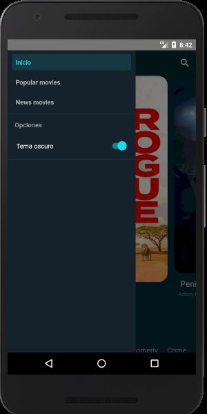
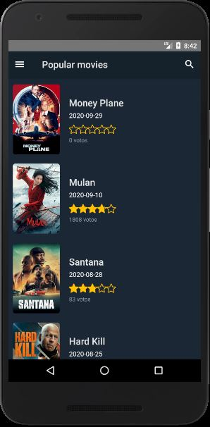
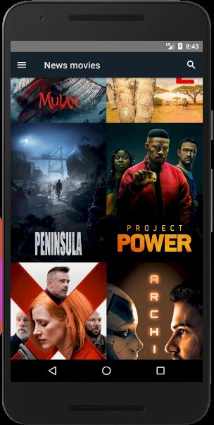
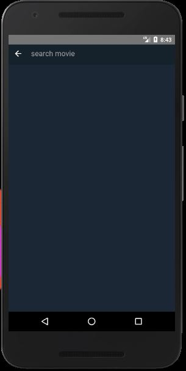
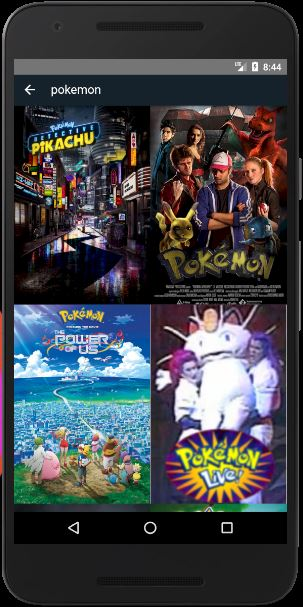
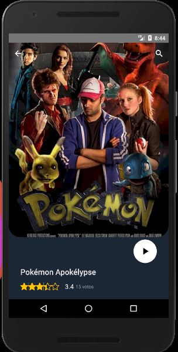
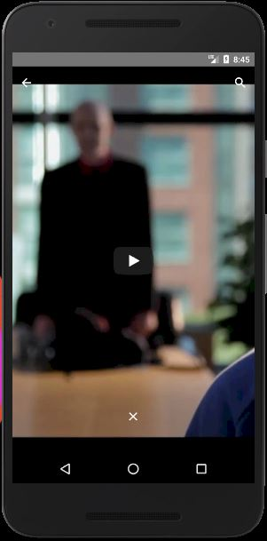
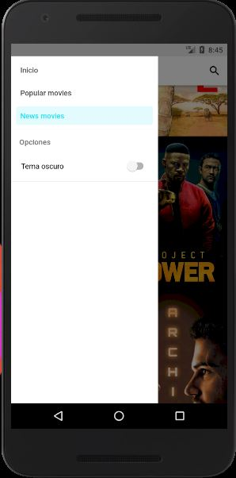

# movie-app
This app query the movies api: 
[https://www.themoviedb.org](https://www.themoviedb.org)

which has three-screen navigation with a drawer-navigation

and with a search screen to find a movie to your liking

 

Also with the evaluation of each film, with the votes with which the evaluation and its most relevant information are averaged, and with the reproduction of the trailer from YouTube

 

and it has dark mode and light mode

 